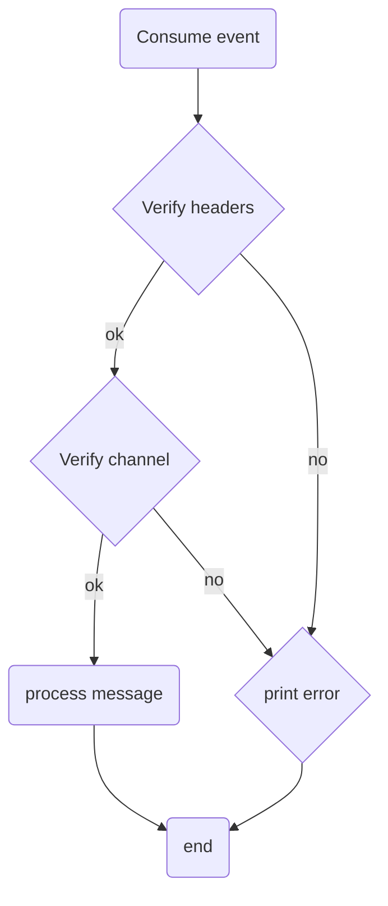
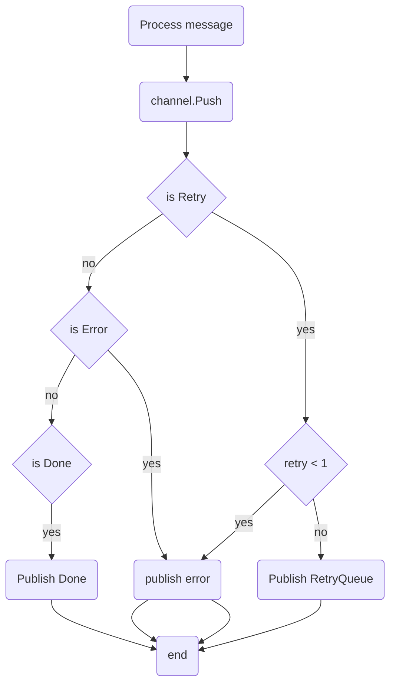
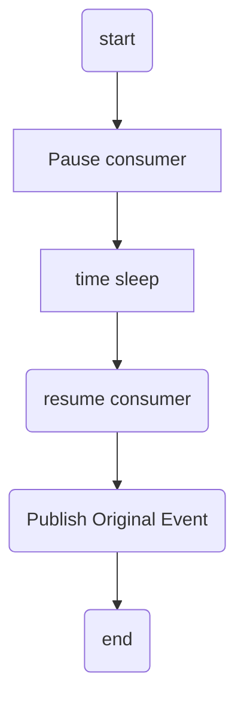

# Task: Please create a notification sending system.

- The system needs to be able to send notifications via several different channels (email, sms, slack) and be easily extensible to support more channels in the future.
- The system needs to be horizontally scalable.
- The system must guarantee an "at least once" SLA for sending the message.
- The interface for accepting notifications to be sent can be chosen on your own discretion.

We expect the test task solution to be submitted in Golang. The source code should be published on GitHub/Bitbucket/GitLab or another Git hosting service. There are no other specific requirements and you are free in your design and implementation decisions.
Please document your solution and design and explain how the system might run in production.

---

#### Definitions:

- Channel -> is a notification type like SMS Email, Slack etc.
- Provider -> will be the third party system which will deliver the notification, like:
  - Gmail for emails
  - InfoBip or Amazon for SMS
  - Slack for Slack
- Body -> is the actual context of the notification like email body and subject, sms text and phone number or slack message

#### Assumptions:

- The system will support only one provider per channel
- Each notification request can be matched to only one channel
- If a notification needs to be pushed to multiple channels, then the sender system will need to push multiple requests. (with appropriate metadata for each channel).
- Channel for email will have configuration for single email account and `from` and `rcpt to` will be provided from the sender system
- Channel for Slack will have configuration authetication for single workspace and only channel Id needs to be provided
- Channel for SMS, provider like InfoBIP as configuration and only the phone number needs to be provided
- All secrets like authentication passwords or tokens will be part of configuration for each channel

`All of the design decision are based on these assumptions.`

## Implementations

###### I chose to create an Event-Driven system, since the nature of notifications is in general asynchronous and triggered by events in other systems.

###### We can have the following main event types:

1. `NotificationRequest` -> trigger by any system which needs to notify external actor/system.
2. `NotificationDone` -> will be triggered from this system when a notification was successfully pushed to the external provider
   These events can be consumed by the sender it self for additional processing, as well can be consumed from other subsystems for additional processing

3. `NotificationError` -> will be triggered from this system when a notification was not deliver to the external provider after multiple retries

Other benefits of using `Event-Driven approach` is that we can have multiple other systems which can consume these events and add `free` futures to the business like accounting, success/error rate.

##### I have selected not to use persistent layer in here like RDBMS or NoSQL. The requirement are stating that we don`t need specific needs for such.

###### Never the less the use of Apache Kafka can be identified as persistent layer.

##### For retry mechanism, I have selected to use again event-driven delay queue as a separate system.

On deliver failure to the provider, the notification event will be pushed to the retry queue subsystem.
To avoid endless loop and overloading of the systems, retry limit will be introduced.

###### Events in the `Retry Queue` system

1. `RetryQueueRequest` -> any system can push events here on failer.

`Retry Queue` subsystem will consume each event, then will delay(sleep) predefined amount of time, and will push the event back to original consumer system, in our case notifications system `NotificationRequest`.

The same queue subsystem can be used for multiple retry scenarios regardless of the payload and the events.
All the parameters related to the originating system will be set to the event header(s), and will not effect the original payload.

Also for more complex queueing mechanism, multiple queues can be deployed with different params like retry policy/delay time etc.

Other benefits of this approach is scaling up/down can be done very fast.

I have selected not to use persistent layer for queueing, because: FIFO table(s) in any kind of database is hard to create, and also hard to scale.

For even more control of the failers, additional reconciliation system(s) can be created.

---

##### Based on the requements here are the implementations decistions which to me seems apropritate:

- ###### _Requement:_ `The interface for accepting notifications to be sent can be chosen on your own discretion.`

General decision is to select interface/transport/protocol of how other system will interact with this.

Transport layer:

I have selected Apache Kafka for the transport layer. and JSON for the data.
Some feature out of the box:

    - Kafka
        - Fault tolerance
        - Low Latency
        - High Throughput
        - Durability
        - Distributed system
        - Scalable
    - JSON
        - easy to debug
        - relatively fast for parsing/serializing

Other options:

- Transport
  - HTTP 1.1 with LB is `synchronous`
  - gRPC Google implemtation of Remote Procedure Call, based on HTTP2 and Protobuf (gRPC is transport layer)
    - PRO:
      - shared repos for all methods/endpoints/payloads between services/teams
      - faster compared to HTTP1.1
      - client is with built in fault tolerant
    - CON
      - `add additional complexity (precompile steps for building sources)`
      - `No easy way of testing/debugging with common tools like cURL or Postman`
- Data
  - XML `parsing and data big overhead`
  - Protobuf Google language-neutral mechanism of serializing structured data in binary format (protocol layer)
    - it is part of gRPC protocol but can be used only for serialization
    - shared repos for all methods/endpoints/payloads between services/teams
    - Very good option when we have multiple microservices from multiple teams
    - `add additional complexity (precompile steps for building sources)`
    - `No easy way for testing testing/debugging with common tools like cURL or Postman`
  - JSON very good compromise between performance and debug friendly

##### In addition to that, it is good practise to enable HTTP for the following functionality:

    - HTTP endpoints for `health` and `ready` status are needed for proper cluster deployments like:
        Docker Swarm, K8S, AWS, GCP, etc...
    - HTTP endpoints for collection application metrics are also good ( not implemented in here)
        Prometheus/Elastic or other monitoring/alerting systems

---

- ###### _Requement:_ `The system needs to be able to send notifications via several different channels (email, sms, slack) and be easily extensible to support more channels in the future.`

Since each of these channels could require defferent data for sending like:

- SMS needs phone number, and in some cases each message can be bigger then 160 charecters.
- Slack needs destination channel ID,
- Email needs `rcpt`, `from` email addresses and `subject`

###### All request payload will have Map type field, so each channel implementation will be able to verify these data

Channels extendability:

1. Each channel will have a `name` by which it will be selected
2. Each channel will have `Configure` method for initializing
3. Each channel will implement `NotificationService` interface

   - method `Name` will return the name of the channel.
   - method `Push` will attempt to send the message to the provider and will return `enum` with three options:

     - DONE will be return when the channel provider has accepted the message
       this event will be forwared to the `PublishRetry` topic
     - ERROR will be when fields are not set properly and this notification can not be delivered the the channel
       this event will be forwared to the `PublishError` topic
     - RETRY will be when channel provider did not accept the message due transport or other errors.
       this event will be forwared to the `PublishRetry` topic

- ###### _Requement:_ `The system needs to be horizontally scalable.`

For very fast and dynamic horizontal scaling each part of the system needs to be stateless.
The Notification App and the RetryQueue can be scaled up/down on demand.

Such scaling depends on the Apache Kafka Topics configuration ( number of partitions and number of consumer instances).
Current implemention is that single instance will have single thread for procssing incomming events.

To scale we only need to increase the number of instances per service. ( Kubernets replicas)
We have three scenarios:

1. number of partitions == instances
2. number of partitions > instances
   some instances will read from more then one partition
3. number of partitions < instances
   some instances will be idle

Best practises is to have partitions number per topic to be high, so it will enable easy scale up, but not too big because Kafka brokers will have hard time to rebalance when joining new consumer.

Apache Kafka is the only stateful subsystem, but also easy to scale up, a bit hard to scale down.

- ###### _Requement:_ `_The system must guarantee an "at least once" SLA for sending the message.`

  When using Kafka consumer, we will commit a message in batches, in case of crashe wil could have doble processing. This option is left as configuration `<PREFIX>.commit.counter`.

# Source tree

- [common-lib/app/](common-lib/app/) common lib for service, includes http basic methods
- [common-lib/config/](common-lib/config/) common lib for configs and logging, based on [viper](github.com/spf13/viper) and [logrus](github.com/sirupsen/logrus)
- [common-lib/eventbus/](common-lib/eventbus/) common lib for consuming and publishng events to Kafka, based on [github.com/confluentinc/confluent-kafka-go/kafka](github.com/confluentinc/confluent-kafka-go/kafka)
- [configs/](configs/) basic app config file in yaml format

# Deployment

1. Ci/Cd for sources

- after each push or merge a docker image build should be triggered
  - these should include the unit test in the sources
- some lint check and/or global SonarQube for quality gates
- a deployment to dev env auto triggered end to end testing ( for `RetryQueue` some benchmarks as well)
- other test or deploy to UAT -> PROD
- Production deployment on K8S can be based on [k8s](k8s) files
  - auto scalling based on CPU/Ram usage can be configured

2. Apache kafka could be installed on VMs or K8S

# Notifications system diagram

# Message process diagram

# Queue system diagram

